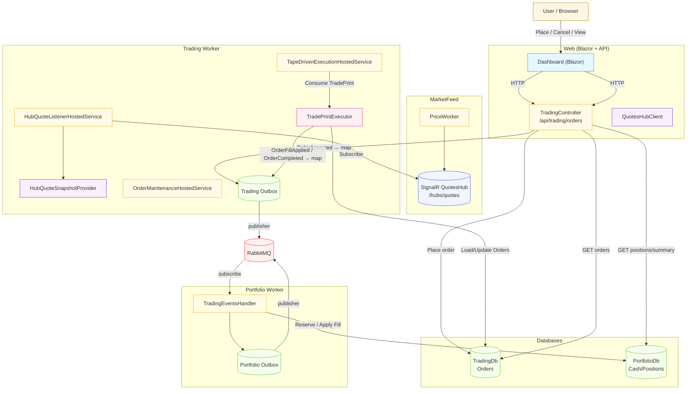
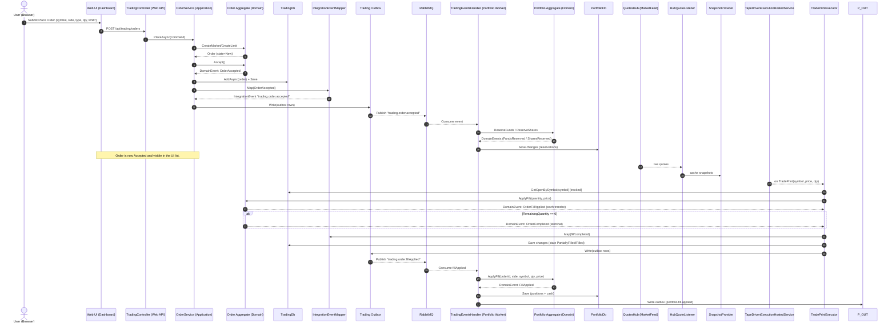
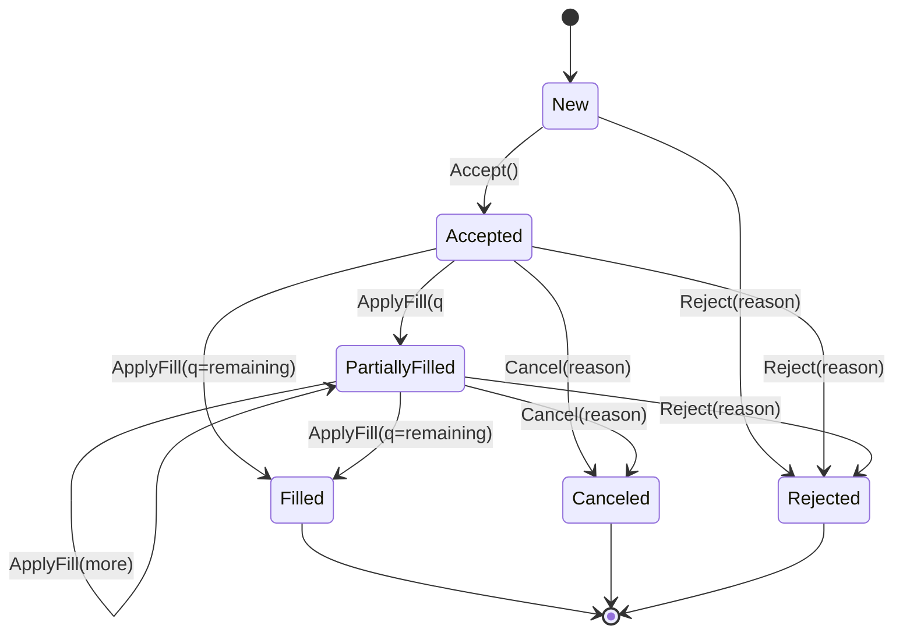

# StockSim — Architecture and Order Lifecycle (Mermaid)

This document shows:
- A high-level architecture overview.
- The end-to-end lifecycle of an order (placement → acceptance → execution → portfolio updates).
- The order state machine.

Note: This Mermaid uses broadly compatible syntax:
- `graph TB` instead of `flowchart TB`
- Class assignments via `class` (not `:::`)
- Subgraph labels as `subgraph ID [Label]`

## 1) Architecture Overview

---

## 2) Order Lifecycle (end-to-end)

---

## 3) Order State Machine

---