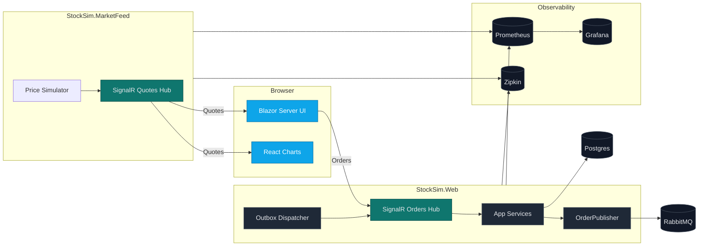

# StockSim Architecture

## System Overview

```mermaid
flowchart LR

  %% Groups
  subgraph Browser
    UI["Blazor Server UI"]
    ReactApp["React Charts"]
  end

  subgraph WebApp["StockSim.Web"]
    HubOrders["SignalR Orders Hub"]
    Services["App Services"]
    OrderPublisher["OrderPublisher"]
    OutboxDispatcher["Outbox Dispatcher"]
  end

  subgraph MarketFeed["StockSim.MarketFeed"]
    HubQuotes["SignalR Quotes Hub"]
    PriceSim["Price Simulator"]
  end

  subgraph Observability
    Prometheus[(Prometheus)]
    Grafana[(Grafana)]
    Zipkin[(Zipkin)]
  end

  %% Infra
  Rabbit[(RabbitMQ)]
  DB[(Postgres)]

  %% Data flows
  UI -- "Orders" --> HubOrders
  HubOrders --> Services
  Services --> OrderPublisher --> Rabbit
  OutboxDispatcher --> HubOrders

  PriceSim --> HubQuotes
  HubQuotes -- "Quotes" --> UI
  HubQuotes -- "Quotes" --> ReactApp

  Services --> DB

  %% Observability wiring (logical)
  WebApp --> Prometheus
  MarketFeed --> Prometheus
  WebApp --> Zipkin
  MarketFeed --> Zipkin
  Prometheus --> Grafana

  %% Styling (GitHub-compatible)
  classDef ui fill:#0ea5e9,stroke:#0369a1,color:#ffffff;
  classDef hub fill:#0f766e,stroke:#134e4a,color:#e5e7eb;
  classDef svc fill:#1f2937,stroke:#4b5563,color:#e5e7eb;
  classDef infra fill:#111827,stroke:#4b5563,color:#e5e7eb;

  class UI,ReactApp ui;
  class HubOrders,HubQuotes hub;
  class Services,OrderPublisher,OutboxDispatcher svc;
  class Rabbit,DB,Prometheus,Grafana,Zipkin infra;
```
